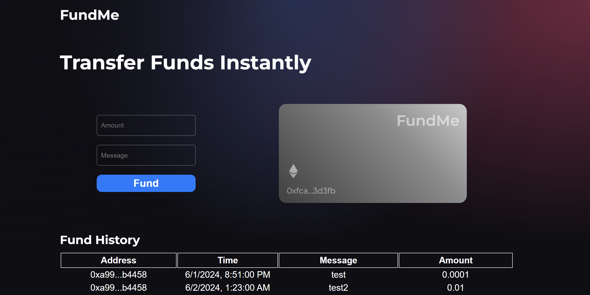

# FundMe Project

This project is my implementation of the web3.0 FundMe project. It features a frontend interface that allows users to interact with a smart contract by funding it and sending a message along with their transaction. The interface then displays all the transactions along with the messages.



## Features

- **Fund the Contract**: Users can send Ether to the smart contract and attach a message with their transaction.
- **View Transactions**: All transactions are listed displaying the sender, timestamp, message and the amount.

## Technologies Used

- **Solidity**
- **React**
- **Ethers.js**
- **Hardhat**

### Installation

1. **Clone the repository:**
   ```bash
   git clone https://github.com/gautam-4/fundme.git
   cd fundme

2. **Navigate to frontend:**
   ```bash
   cd client
   
3. **Install dependencies and run the frontend:**
   ```bash
   npm i
   npm run dev